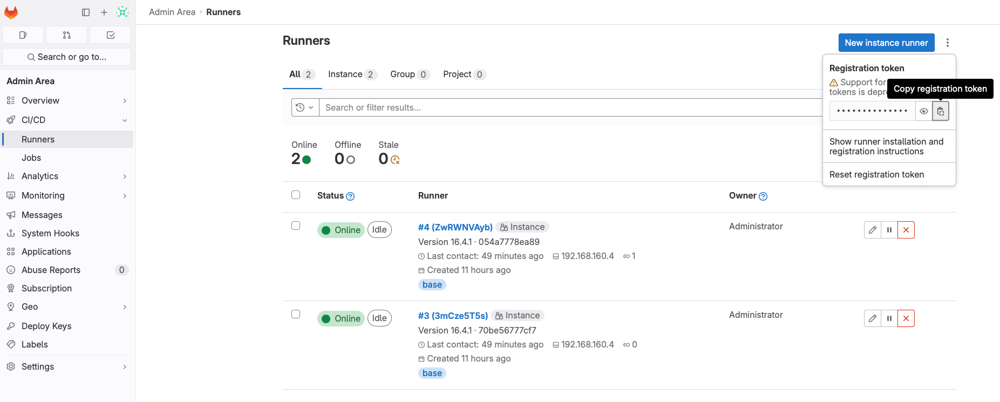

# Purpose
Development environment comprised of a docker composed gitlab deployment with docker runners.
--- 

## Deployment
- update .env_template file with your own values (domain name, gitlab root password, etc.) and change the name to .env
    - Makefile will replace #{variables}# in docker-compose.yml with values in .env
- add the make package to your shell environment and run `make main` from the root of the project.
    - `make main` will build the docker images, recreate TLS certs, create the docker network, and start the containers.
- get runner registration token from gitlab server
    
- register the runners by using `scripts/runner_registration` configuration
    - export the token to your shell before running the script
    

## Runner Additional Configuration
- add `network_mode = "<docker network>"` to the runner config file / runner registration script; must match docker-compose network configuration.
    - added to runner registration script.

## Gotchas
- restart runner after registering it
- runners may not be able to access the gitlab server without adding `network_mode = "<docker network>"` to the runner config file.
- *docker* runners need to have the docker default unix socket as a bound volume: `"/var/run/docker.sock:/var/run/docker.sock"`; add to toml config
    ```
    [runners.docker]
    ...
    volumes = ["/cache", "/var/run/docker.sock:/var/run/docker.sock"]
    ```
- modify git config to trust self signed PKI or disable git TLS config per instructions here: https://docs.gitlab.com/omnibus/settings/ssl/ssl_troubleshooting.html#unable-to-perform-git-operations-due-to-an-internal-or-self-signed-certificate
    - `git config http.sslVerify false`

## TODO
- [x] Add make toolchain to streamline deployment
- [x] Create certificate authority container
- [x] Create script to loop through all runners and register them
- [x] Create bash and powershell executors for gitlab runners
- [x] Add packer and terraform builders and plugins to gitlab runner
- [ ] Move certificate authority creation logic from scripts to ca container and share via docker volume
- [x] Remove all secrets from variables.tf and use environment variables substitution, vault api, or gitlab secret variables
- [ ] Add kaniko builder to runner and remove privileged mode


